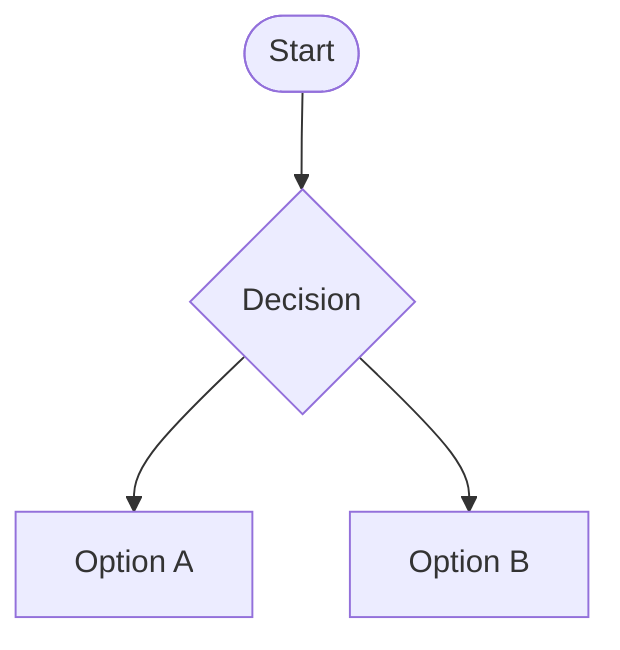

> **TL;DR** – Using Bluetooth and FreeRTOS to read data from robot and control it wirelessly. 

Source code: <https://github.com/va7mii/IGEN230-Line-Robot>


In IGEN 230 (2nd year project course), we had to built a line following robot using ESP-32. To make things interesting, I decided to use Bluetooth to control the robot and help with calibration.

The code makes uses FreeRTOS (real-time operating system) to facilitate running multiple tasks at once
* **Pros:** Easier to organize code, allow for precise timing of things to be run, opportunity to improve C-coding skills
* **Cons:** Big learning curve, risk of resetting the ESP32 due to a memory leak, 


When connected to Bluetooth, the user can connect the ESP32 with any device that can do Serial inputs (e.g. Windows laptop, Android device). 

Bluetooth Output: IR sensor data on a Serial terminal
The user can also input commands to control the robot using the format [character] [number] [some other number]

```c++
s [leftSpeed] [rightSpeed] // used in the joystick to control left and right motors
c // to trigger a calibration reading
m // manual control
a // switch back to automatic line following
p/i/d/b [value] // adjust Kp, Ki, Kd [PID parameters] or a base speed on the fly
```

Here is an example what commands would be read from the Serial in the robot:

```c++
c 		// Reads the sensor values from the white surface
c	 	// Reads values from the black line
// Robot is moving
b 45 		// Change base speed to 45
p 30 		//Change the Kp parameter (in PID control) to 30
m 		// Change to manual mode [or controller ‘A’ button]
[controlling the robot with the controller’s two joysticks]
s 10 10 	// Set left motor = 10, right motor = 10 to go straight 
s 10 -10 	// leftmotor = 10, rightmotor = -10, a right turn
s 0 0 		//leftmotor = 0, rightmotor = 0, stop robot
a 		//switch back to an automatic line follow mode
//[turn off] / [reset button]
```

Based on the diagram, the ESP32 runs Serial Read, Sensor Task, and Motor Task concurrently

When doing the calibration, the ESP32 outputs like
Calibrating white base: sensor0 = 21.00, sensor1 = 31.00, sensor2 = 0.00, sensor3 = 29.00, sensor4 = 0.00,
However for calibrating the black line, the ESP32 takes the maximum reading it received so far to be able capture the maximum possible sensor value when it reads a black line. 

Using a Nintendo Switch Pro controller
Using the left and right joysticks (Y-axis) we can control the speed of the left and right motors (both directions).
A Python script (using PyGame library) converts the joystick inputs into” s [leftMotor] [rightMotor]” keyboard commands to control the motor
Because of that, we require the user to press the right trigger “R” in order to control the joystick
Other keybindings
Left trigger “L” to press “c” for calibration
“A” button to press “m” for manual mode
“B” button to press “a” for auto mode





## BOM Highlights

| Part | Purpose |
|------|---------|
| ESP32‑WROOM‑32D | MCU + Wi‑Fi/BLE | 
| L298N H‑bridge | Motor driver | 
| QR1114 IR sensors ×5 | Line detection (IR LED + Phototransistor) | 


<div class="row">
  <div class="col-sm mt-3">
    
  </div>
  <div class="col-sm mt-3">
    
  </div>
  <div class="col-sm mt-3">
    
  </div>
</div>
<div class="caption">
  Left: Front View of Robot. 
  
  Centre: Robot on Track. Right: 
  
  Calibration info on Serial Monitor
</div>